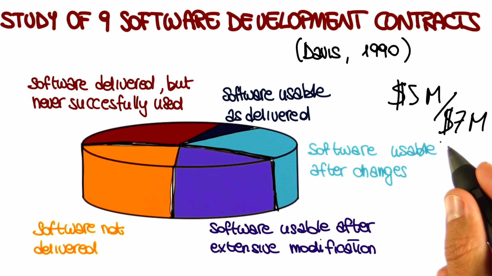

# Introduction and Overview

Read more about, [Importance of Software Engineering.](https://github.com/avinashbest/software-engineering-udacity/blob/master/importance_of_software_engineering.md)

## Software Failure

> Explosion of Ariane 5 rocket due to software errors.

[History's Worst Software Bugs](https://www.wired.com/2005/11/historys-worst-software-bugs/?currentPage=all)

## Discipline of Software Engineering

> Software Problems: Typically Crash

> Why is it so hard to build good software?

`Software Engineering` is a `set of methodologies`, `techniques, and tools`, that will help us `build high quality software` that does what it's `supposed to do`. And therefore, makes our customers happy. And that does it within the `given time and money constraints`. So within the budget that is allocated for the software.

## The Software Crisis

In late 60's, the `first man landed on the moon`. That was also time when `Woodstock took place` and also the time when the `first 60 second picture from Polaroid` was created. Concurrently to these events, which you probably didn't witness in first person, that was also the time when people started to realize that they were not able to build the software they needed. This happended for several reasons and resulted in what we call the `software crisis`.

Some of the most important reasons behind this software crisis:

- `Rising demand for software:` Now we're used to see software everywhere; in our phone, in our car, even your washing machine. Before the 60s, however, the size and complexity of software was very limited and hardware components were really dominating the scene. Then things started to change and software started to be increasingly prevalent. So, we move form a situation where everything was mostly hardware to a situation in which software became more and more important.

  **for e.g,** Growth in NASA's software demand is exponentially. And the same happened in a lot of other companies. For e.g, just cite one, for Boeing. So the amount of software on airplanes became larger and larger.

  

- `The increasing amount of development effort needed due to the increase of product complexity:` Unfortunately, software complexity does not increase linearly with size. It is not the same thing to write software for `example` a `class exercise` or a `small project`, or a `term project`, than it is to build a software for a `word processor` an `operating system`, a `distributed system`, or even more complex and larger system.

  

  For the former, the heroic effort of an individual developer can get the job done. So, that's what we call a `programming effort`. If you're a good programmer, you can go sit down and do it, right. For the later, this is not possible. this is what we call the `software engineering effort`. In fact, no matter how much programming languages, developments environments, and software tools improve, developers could not keep up with increasing software size and complexity. Which leads us to the third problem.

- `Slow developer's productivity growth:` Growth in software size and complexity over time, and how the developer's productivity really couldn't keep up with this additional software complexity, which resulted in the gap between what was needed and what was actually available.

  

## Evidence of the Software Crisis

Result of study perform by Davis in 1990s. So in even more recent times than the 60s and the 70s. And the study was performed on nine software projects that were totaling a cost around $7 million.

In short, there was clear evidence the software was becoming to difficult too build and that the software industry was facing a crisis. And this is what led to the `NATO Software Engineering Conference` that was held in `January 1969`, which is what we can consider the birth of software engineering.

You can access the proceedings of the NATO Software Engineering Conferences, and other related information, [here](http://homepages.cs.ncl.ac.uk/brian.randell/NATO/)

## Software Development

`Software development` is fundamentally going from an `abstract idea` in somebody's head, for e.g, the customer's head, to a `concrete system` that actually `implements` that idea and hopefully it does in the `right way.`

And this is a very complex process. It can be overwhelming. So, unless we are taking about the trivial system, it's very complex for us to keep in mind all the different aspects of the systems, and to do all the different steps required to build this system, automatically. So, that's when software processes come to the rescue.

**What is software process?**

A `software process` is nothing else but a way of `breaking down` this otherwise `unmanageable task into smaller steps.` In smaller steps that we can handle. And that can be tackled individually.

So having a software process is of fundamental importance for several reasons.

- For non-trivial systems, we can't just do it by getting it, by just sitting down and developing. What you have to do instead is to break down the complexity in a systematic way. So `software processes are normally systematic`. And you need to break down this complexity, in a more or less formal way. So, software processes are also a `formal`, or `semiformal`, way of `discussing`, or `describing`, how software should be developed.

## Software Process

The four main software processes are:

- `Waterfall Model/Process:` In this process we go from one phase to the other in the same way in which water follows the flow in a waterfall.
- `Evolutionary Prototyping:` In this process we start with an initial prototype and evolve it based on the feedback from the customer.
- `Rational Unified Process (RUP):` This is the kind of process heavily based on the UML (Unified Modeling Language).
- `Agile:` These are the processes in which we sacrifice the discipline a little bit, in order to be more flexible and be more able to account for changes and in particular for changes in requirements.

**Q.** **How many Line of code (LOC) per day you think professional software engineers produce?**

    [❌] 25
    [❌] 25 - 50
    [✅] 50 - 100
    [❌] 100 - 1000
    [❌] more than 1000

## Software Phases

Software processes are normally characterized by several phases, what we call the `software phases`, and only one of these phases is mainly focused on coding. The other phases are meant to support other parts of software development. The phases are as follows:

- **Requirement Engineering:** In this phases we talk to the customer, to the stakeholders, whoever we are building the software for. And we try to understand what kind of system we need to build.

- **Design:** Then, we use requirement engineering's information to define our design and the design is the high-level structure, that then can become more and more detailed, of our software system.

- **Implementation:** After Design, we move to implementation phase in which we write code that implements the design which we just define.

- **Verification & Validation:** After implementing the code, we need to verify and validate the code. We need to make sure that the code behaves as intended.

- **Maintenance:** It involves several activities like, adding new functionality or eliminating bugs from the code or responding to problems that were reported from the field after we released the software.

## Tools of the Trade

Tools and automation are fundamental, in software engineering. They are fundamental for improving productivity, not only efficiency but also effectiveness of our activities in the software development process.

Tools helps us to do change in developer's productivity and basically move this curve up. So that it gets closer and closer to what we need to develop the software that we need to build.

for e.g, in `development`, think about what kind of improvement it was to go `from punch card to modern IDEs`. If we're talking about languages, think about how much more productive developers became when going `from writing machine code` to writing `code in high-level languages`. And finally, `debugging`, which is a very important and expensive activity, moving from the use of print lines to the use of symbolic debuggers dramatically improve the effectiveness and efficiency of development.

