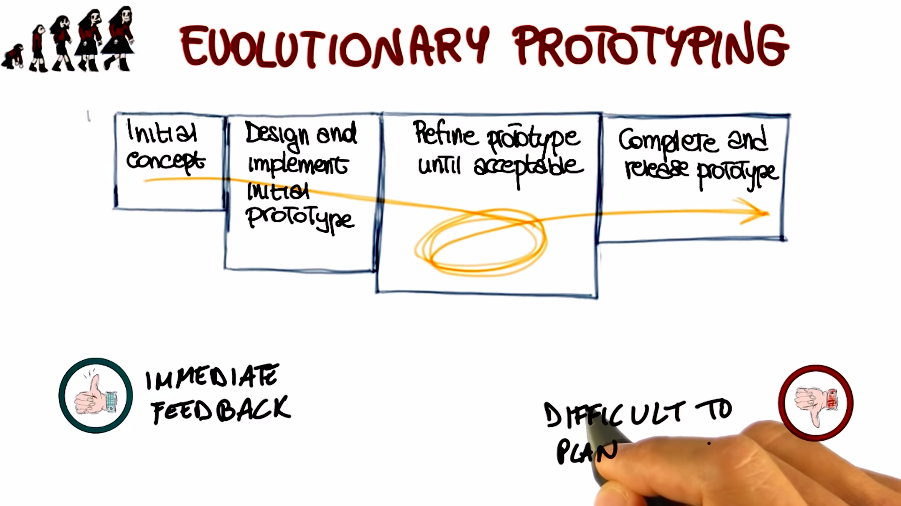
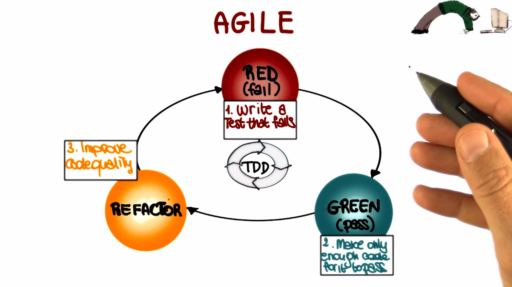

# Life Cycle Models

## Introduction with Barry Boehm

The bottom line is that choosing the right lifecycle model is fundamental importance.

## Traditional Software Phases

Software engineering is an important and critical discipline, concerned with cost effective software development. This is based on a systematic approach that uses appropriate tools and techniques, operates under specific development constraints. And most importantly, follows a process.

## Requirements Engineering

It is a field within software engineering that deals with establishing the needs of stakeholders that are to be solved by software.

**Why is this phase so important?**

In general, the cost of correcting an error depends on the number of subsequent decisions that are based on it. Therefore, errors made in understanding requirements have the potential for greatest cost because many other design decisions depends on them and many other follow up decisions depend on them.

If we discover a problem in `maintenance` we're left to undo a lot of decision that we had made before to correct the error. Whereas if we find an error in `requirements` we can correct it right away and we don't affect the subsequent phases.

**How can we collect the right requirements?**

Traditional requirements engineering does so through a set of steps:

- `Elicitation` which is the collection of requirements from stake holders and other sources and can be done in a variety of ways.

- `Requirement Analysis` which involved the study and deeper understanding of the collective requirements.

- `Specification` of requirements, in which the collective requirements are suitably represented, organized and save so that they can be shared.

- `Validation` to make sure they're complete, consistent, no redundant and so on. So that they've satisfied a set of importance properties, for requirements.

- `Requirements Managements` which accounts for changes to requirements during the lifecycle of the project. And here

## Design

`Software Design` is the phase where software requirements are analyzed in order to produce a description of the internal structure and organization of the system.

Traditionally, the software design phase consists of a series of design activities. Which normally consists of the `architectural design phase`, `the abstract specification` , `interface design`, `component design`, `data structure` and `algorithm design`.

The important point is that we go from sort of `a high-level view of the system`, which is the architectural design, `to a low-level view`, which is the algorithm design. And these activities result in a set of design products, which describe various characteristics of the systems.

**For e.g,** _they describe the architecture of the system, so how the system is decomposed and organized into components, the interfaces between these components. They also describe these components into a level of details that is suitable for allowing their construction._

## Implementation

What we do in this phase is taking care of realizing the design of the system that we just created and create an actual software system.

There are four fundamental principles, four pillars that can affect the way in which software is constructed:

- `Reduction of complexity` this aims to build software that is easier to understand and use.

- `Anticipation of diversity` which takes into account that software construction might change in various way over time. i.e, software evolves. In many cases, it evolves in unexpected ways. And therefore, we have to be able to anticipate some of these changes.

- `Structuring for validation` also called _design for testability_, it means that we want to build software so that it is easily testable during the subsequent validation and verification activities.

- Finally and that is especially true within specific organizations and or domains. It is important that the `software conforms to a set of internal or external standards.` And some e.g, of this might be internal standards, coding standards within an organization, or naming standards within an organization, etc.

## Verification & Validation

It is that phase of software development that aims to check that the software system meets its specification and fulfill its requirements.

**Validation** activity that answers the question `did we build the right software system?`. Did we build the system that the customer wants? That will make the customer happy.

**Verification** answers the different question which is `did we build the system right.` So given a description of the system that is the one that we derived from the customer through the collection of requirements and then design and so on, did we a system that actually implements the specification that we defined? Verification can be performed at different levels.

- In particular, it can be performed at `Unit Level` in which we test that the individual units work as a expected.

- Can be performed in the `Integration Level` in which we test is the interaction between the different units. So we want to make sure that the different modules talk to each other in the right way.

- And finally, there is `System Testing` in which we test the system as a whole and we want to make sure that all the system, all the different pieces of the system work together in the right way. And this is also the level at which then we will apply validation and some other testing techniques like stress testing or robustness testing and so on.

## Maintenance

As we known software development efforts normally result in the delivery of a software product that satisfies the user requirements.

So normally our software development organization will release this application to its final users, however, once the software is in operation many things can happen.

**for e.g,** the environment might change, there might be new systems in which our software has to operate. Or they may be feature requests, so the users man find out that, guess what, they want to do something different with the problem that we gave them. Or, again, and this is one of the most common occurrences, users might find problems with the software and may file bug reports and send the bug reports back to the software developer. These are the reasons why software maintenance is a necessary phase in software development.

`Software Maintenance` is the activity that sustains the software product as it evolves throughout its life cycle, specifically in response to bug reports, feature requests and environment changes development organizations perform three kinds of maintenance activities:

- `Corrective maintenance` to eliminate problems with the code.
- `Perfective maintenance` to accommodate feature request, and in some cases just to improve the software, for e.g, to make it more efficient.
- `Adaptive maintenance` to take care of the environment changes.

After these activities are performed, the software developer will produce a new version of the application, will release it and the cycle will continue through our the lifetime of the software.

That's why maintenance is a fundamental activity and a very expensive one. And one of the reasons why maintenance is expensive, is `regression testing` during maintenance every time you modify your application you have to regression test the application, where regression testing is the activity re-testing software after it has been modified to make sure that the changes performed to the software work as expected, and that _changes did not introduce any unforseen effects._

**for e.g,** a version of software being released and just a couple of days later another version being released to fix some problems that occur with the new version. These problems is called as regression testing.

**Q. What are the traditional software phases?**

    [❌] Requirements engineering, design, abstraction, implementation, verification & validation.
    [❌] Design, optimization, implementation, verification & validation, maintenance.
    [✅] Requirements engineering, design, implementation, verification & validation, maintenance.

## Software Process Model Introduction

Also called as `Software Lifecycle Model.`

_It is a prescriptive model of what should happen from the very beginning to the very end of the software development process._

The main function of the life cycle model is to _determine the order of the different activities_ so that we know which activities should came first and which ones should follow.

Another function is to _determine the transition criteria between activities._ So, when we can go from one phase to the subsequent one. In other words, what the model should describe is what should we do next in and how long should we continue to do it for each activity in the model.

## Waterfall Model

- Waterfall model is the `grandfather` of all the lifecycle models.

- In the waterfall model the project `progresses to an orderly sequence of steps.` From the initial software concept, down until the final phase.

- At the `end of the each phase` there will be a `review to determine` whether the project is `ready` to advance to the `next phase`.

- The pure waterfall model `performs well` for` softer products` in which there is a `stable product definition.` The domain is well known and the technologies involved are well understood. In these kind of domains, the waterfall model helps us to find errors in the early, local stages of the projects.

  

**Advantages:**

- It allows us to find errors in the early stages of the project or easily.

**Disadvantage:**

- It is not very flexible. Normally, it is difficult to fully specify requirements at the beginning of the project. And this lack of flexibility is far ideal when dealing with project in which requirements change, the developers are not domain experts or the technology used are new and evolving, that is it is less than ideal for most real world projects.

## Spiral Process

It was first described by `Barry Boehm` in his paper from `1986` that was entitled `Spiral Model of Software Development and Enhancement.` And one of main characteristics of that paper is that it was describing the spiral model using a diagram.

These diagrams has become very very popular.

The Spiral model is an `incremental risk-oriented lifecycle model` that has four main phases listed as follows:

- Determine Objectives
- Identify and resolve risks
- Development and Tests
- Plan the next iteration

A software project will go through these four phases in an iterative way.

- In the `first phase`, the requirements will be gathered.
- In the `second phase`, the risks and the alternate solutions will be identified, and a prototype will be produced.
- Software and tests for the software are produced in the development and test phase, which is the `third phase`.
- Finally, `fourth phase`, the output of the project is evaluated and the next iteration is planned.

`Spiral process` prescribes is a way of developing software by going through these phases in an iterative way, in which we learn more and more of the software, we identify more and more and account for more and more risks and we go more and more towards our final solution, our final release.

**Advantages:**

- Extensive risk analysis does reduce the chances of the project to fail. So there is a risk reduction advantage.
- Functionality can be added at a later phase because of the iterative nature of process.
- Software is produced early in the software lifecycle. So, at any iteration we have something to show for our development. We don't wait until the end before producing something.
- Get early feedback from the customer about what we produced.

**Disadvantages:**

- The risk analysis requires highly specific expertise.
- And unfortunately, the whole success of the process is highly dependent on risk analysis.
- It is way more complex then the waterfall model.

## Evolutionary Prototyping

It works in four main phases.

- We start from an `initial concept`, that we design and implement a prototype based ont this concept, refine the prototype until it is acceptable, and finally we complete and release the final product.

- Therefore, when developing a system using evolutionary prototyping, the `system is continually refined and rebuilt.` So it is an ideal process when not all requirements are well understood Which is a very common situation.

- Developers start by developing the parts of the system that they understand, instead of working on developing a whole system, including parts that might not be very clear at that stage.

- The partial system is then shown to the customer and the `customer feedback is used to drive the next iteration,` in which either changes are made to the current features or new features are added. So, either the current prototype is improved or the prototype is extended.

- And finally, when the customer agrees that the `prototype is good enough, the developers will complete all the remaining work` on the system and release the prototype as the final product.

**Advantages:**

- Immediate feedback from the customer. Developers gets feedback as soon as they produce a prototype and they show it to the customer and therefore, the risk of implementing the wrong system is minimized.

**Disadvantages:**

- It's difficult to plan in advance how long the development is going to take, because we don't know how many iterations will be needed. And another drawback, it can easily become an excuse to do kind of do cut and fix kind of approaches in which we hack something together, fix the main issues when the customer gives us feedback, and then continue this way, until the final product is something that is king of working, but it's not really a product of high quality.

## Rational Unified Process (RUP)

- RUP is very popular one based on the Unified Modeling Language (UML) model.

- RUP works in an iterative way, which means it that it performs different iterations. And at each iteration, it performs four phases.

  

- So, in each one of these four phases, we perform standard software engineering activities. And we do them to different extent, based on the phase i which we are.

- In particular, in the `Inception phase` the work is mostly to sculpt the system. So basically figuring out what is the scope of the work, what is the scope of the project, what is the domain. So that we can be able to perform initial cost and budget estimates.

- The `Operational phase` is the the phase in which we focus on the domain analysis and define the basic architecture for the system. So this is a phase in which analysis and design are particularly paramount.

- Then there is a `Construction phase`, which is where the bulk of the development actually occurs.

- And finally, the `Transition phase` is the phase in which the system goes from development into production, so that it becomes available to users. And of course, this is the phase in which the other activities in software development become less relevant and deployment becomes the main one.

## Agile Software Development Process

This is a group of software development methods that are based on highly iterative and incremental development.

In particular, we'll discuss the `Test Driven Development` or TDD.

The space on the iteration of three main phases.

- In the `first one we mark as red,` we write test cases that encode our requirements, and for which we haven't written code yet. And therefore, they will fail, obviously. So we're in this sort of red or fail phase.

- From red phase, we move to `Green phase`, in which after we write the just enough code to make the test cases pass. We have a set of test cases that are all passing. And therefore, we can consider this as the green phase. We have enough code to make the test cases pass because the test cases encode our requirements. We have just written enough code to satisfy our requirements. When we do this over time though, what happens is that the structure of the code deteriorates, because we keep adding pieces.

- So that's why we have to first step. which is `refactoring`. In this step, we modify the code to more readable, more maintainable. In general, we modify to improve the design of the code. And after this phase, we will go back to writing more test cases for new requirements, write code that makes these test cases pass, and so on. So we'll continue to iterate among these phases.

## Choosing a Model

Picking an appropriate model can ensure the success of a project. On the contrary, if we choose the wrong model, that can be a constant source of problems and ultimately, it can make the project fail.

To pick an appropriate model, we need to consider the many factors.

- In particular, we need to be aware of what level of understanding we have of the requirements. Do we understand all the requirements? Are we going to able to collect all the requirements in advance, or collecting requirements is going to be hard and therefore, we might want to follow a process that is more flexible with that respect.

- Another important point is the expected lifetime of the project. Is this a quick project that we are putting together for a specific purpose or something that's going to last for a number of years and that we're going to maintain over all those years?

- Also, what is the level of risk involved? Do we know the domain very well? Do we know exactly the technologies involved? Well, if so, we might go with a traditional process. Otherwise, we might want to be more agile, more flexible.

- It is also very important to know the schedule constraints. How much time, how many resources do we have for this project? What is the expected interaction with the management and the customer?

- In particular for this ladder, there many processes that rely on the fact that there can be a continuous interaction with the customer. If that interaction is not there, there's no way we are going to be able to use these processes.

- Conversely, there are processes that don't require the presence of the customer at all, except for the initial phase and maybe some checking points and so if the customer is very inaccessible, we might want to follow one of those processes, instead of one of the more demanding ones in terms of customer's time.

- Finally, it is important to take into account the level of the expertise of the people involved. Do we have people that know the technologies that we're using? Do we know people that know specific kind of process? Some processes require more specific expertise and we're not going to be able to follow that process if we don't have that expertise.

  

**Q. Which of the following models is suitable to develop a software control system?**

    [✅] Pure Waterfall Model
    [❌] Test Driven Development (Agile)
    [❌] Evolutionary Prototyping

**Q. Which of the following models is suitable if you expect midcourse corrections?**

    [❌] Pure Waterfall Model
    [✅] Spiral Model
    [✅] Evolutionary Prototyping

## Lifecycle Documents

- Documenting the activities carried out during the different phases of the software development lifecycle, is a very important task.

- The documents that we produce are used for different purposes, such as communicative details of the software systems.

- To differentiate the colors, ensure the correct implementation of the system, facilitate maintenance, and so on.

- There are standardized documents that are provided by IEEE that we can use for this purpose. However, they're kind of heavy weight.

- So for the time being, we're going to use lightweight documents.

- To take a look at both the IEEE versions and light-weight versions of these documents, visit [this link.](https://www.udacity.com/wiki/sdp/projects#docs)

## Classic Mistakes : People
