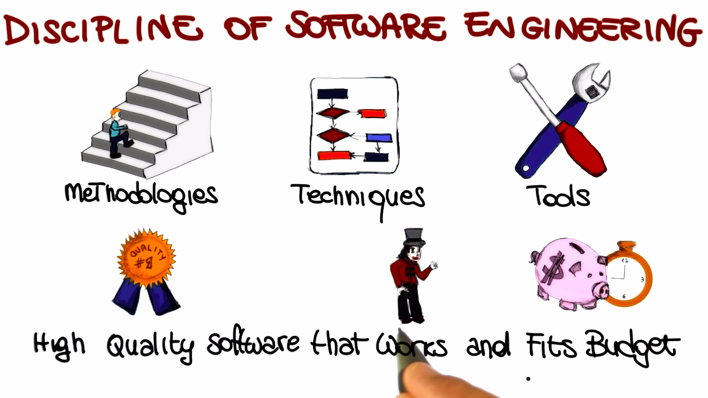
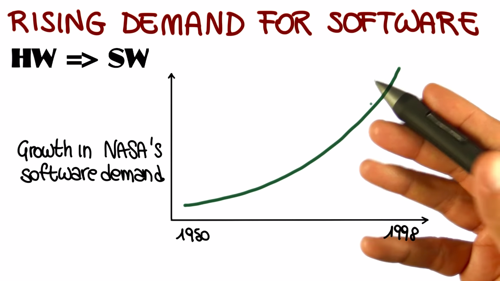
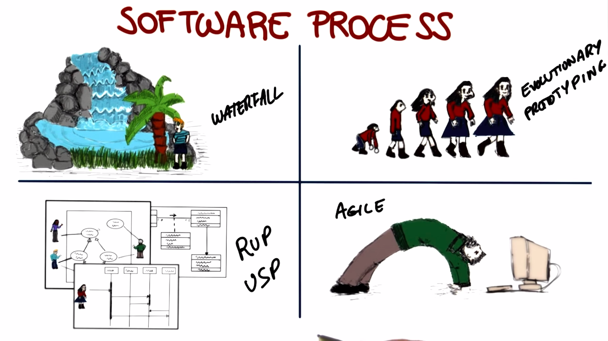

# Software Development Process

## Importance of Software? Why do we need it?

> First, What is a computer? It's a programmable device. So the essence of computing is programming. So program development is basically the most essential use of the computer. So software engineering is the discipline that investigates program development. So, how can it been done more efficiently? What's the best way of doing program development? And how can you develop reliable programs? So that's how I would define it. But I consider any software development activity software engineering activity.

> Software engineering is the systematic application of method to build software in a rigorous way. And I think one of the aspects that I like to bring into the notion of software engineering is that is's something that involves not only kind of technically building the system but understanding the requirements, working with stake holders. Trying to find a solution that balances all of the stakeholders needs in order to deliver the software thats tested and its rigorous to meet the needs of a stakeholder.

> Well, software engineering is the whole process of creation of software using engineering principles.

> My view is kind of a holistic view and I think about it from the perspective of hwo is software engineering different from programming. So, I think that research about programming is all about the create part of software. And that software engineering is about the entire life cycle. So, that's one aspect. And the other aspect of the definition is it's about quality, the quality of software. Software engineering even considers things long after you ship which we all know is one of the, it is the largest economic piece of software development.

> So, improve software engineering process for better software productivity and quality.

> The set of activities that one engages in when building software systems or software products. It's fundamentally a venue-creating activity. It involves social processes.

> Software engineering is the act of many people working together and putting together many versions of large and complex systems. And our world depends on software, software complex and were is immensely complex and we need many, many smart people to build these things.

> Well, engineering I think is the activity of envisioning and realizing valuable new functions with sufficient and justifiable confidence that the resulting system will have all of the critical quality attributes that are necessary for the system to be a success. And software engineering is the activity of doing this not only for the software components of engineering systems but for the system overall, given that it's so heavily reliant on it's underlying software technologies.

> I would say software engineering is the kind of art and practice of building software systems.

> Software engineering, in a nutshell, is a set of methods and principles and techniques that we have developed to enable us to engineer, or build, large software systems that outstrip or outpace one engineer's or even a small team of engineers ability or abilities to understand and construct and maintain overtime. So it requires a lot of people, it requires a long, term investment by an organization or a number of organizations, and often times it requires support for systems that are intended for one purpose but end up getting used for many additional purposes in addition to the original one.

> Software engineering is about building and constructing very large-scale high-quality systems, so the high quality is the big issue.

> Software engineering is engineering discipline of developing software-based systems, usually embedded into larger systems composed of hardware and business processes. Well, software is pervasive in all industry sectors and therefore systems must be reliable, safe and secure. Why can't we just get that by sitting down and writing software? Well, you could if software was small and simple enough to be developed by one or two people together in room. But software development now is distributes, involves teams of people with different backgrounds who have to communicate with each other. It also involves customers, clients, users. Software engineers have to work with hardware engineers, with domain experts and therefore, well, no, we can't simply sit down and start coding.

> Software engineering is mostly being able to program. And you need to be able to put big systems together so that they actually work. And if you don't use software engineering practices, you're not going to be able to put them together? Well, you're not going to be able to reliably put them together. So basically, you could maybe hack something up, but it's not going to necessarily stand the test of time. If somebody wants to change it it's probably going to break.

> It's important because if you don't think about how you're building this system and how you're trading off different aspects, like performance and scalability and reliability, then it's going to end up breaking or not lasting very long or not, not doing everything that you want it to do, or being really expensive.

> If it's not done in a principled way it will be bad and every user will suffer. That's why we need software engineering.

> It is important, because I mean these two goal, productivity, faster, in developing software. And higher quality would be apparently important. Software is everywhere.

> It's important because we use software in everyday life. Everything's built on software systems. And these are ubiquitous across our society.

> It's important because software is everywhere around us and the way we build it, and the way we maintain it, is something that determines almost a basic quality of life nowadays. And getting that software right can make a difference, oftentimes, between a really fun product and one that you won't like to use a reasonably successful company, or one that fails. And in more extreme cases even the difference between life and death, if you think about the software that runs in the airplane on which many of you fly on a regular basis.

> There are programs out there that if they screw up we are all screwed.

> Software engineering is crucially important because it's the engineering discipline that is uniquely capable of carrying out the engineering mission for software reliant systems.

## Software Failure

> Explosion of Ariane 5 rocket due to software errors.

[History's Worst Software Bugs](https://www.wired.com/2005/11/historys-worst-software-bugs/?currentPage=all)

## Discipline of Software Engineering

> Software Problems: Typically Crash

> Why is it so hard to build good software?

`Software Engineering` is a `set of methodologies`, `techniques, and tools`, that will help us `build high quality software` that does what it's `supposed to do`. And therefore, makes our customers happy. And that does it within the `given time and money constraints`. So within the budget that is allocated for the software.

## The Software Crisis

In late 60's, the `first man landed on the moon`. That was also time when `Woodstock took place` and also the time when the `first 60 second picture from Polaroid` was created. Concurrently to these events, which you probably didn't witness in first person, that was also the time when people started to realize that they were not able to build the software they needed. This happended for several reasons and resulted in what we call the `software crisis`.

Some of the most important reasons behind this software crisis:

- `Rising demand for software:` Now we're used to see software everywhere; in our phone, in our car, even your washing machine. Before the 60s, however, the size and complexity of software was very limited and hardware components were really dominating the scene. Then things started to change and software started to be increasingly prevalent. So, we move form a situation where everything was mostly hardware to a situation in which software became more and more important.

  **for e.g,** Growth in NASA's software demand is exponentially. And the same happened in a lot of other companies. For e.g, just cite one, for Boeing. So the amount of software on airplanes became larger and larger.

  

- `The increasing amount of development effort needed due to the increase of product complexity:` Unfortunately, software complexity does not increase linearly with size. It is not the same thing to write software for `example` a `class exercise` or a `small project`, or a `term project`, than it is to build a software for a `word processor` an `operating system`, a `distributed system`, or even more complex and larger system.

  

  For the former, the heroic effort of an individual developer can get the job done. So, that's what we call a `programming effort`. If you're a good programmer, you can go sit down and do it, right. For the later, this is not possible. this is what we call the `software engineering effort`. In fact, no matter how much programming languages, developments environments, and software tools improve, developers could not keep up with increasing software size and complexity. Which leads us to the third problem.

- `Slow developer's productivity growth:` Growth in software size and complexity over time, and how the developer's productivity really couldn't keep up with this additional software complexity, which resulted in the gap between what was needed and what was actually available.

  

## Evidence of the Software Crisis

Result of study perform by Davis in 1990s. So in even more recent times than the 60s and the 70s. And the study was performed on nine software projects that were totaling a cost around $7 million.

In short, there was clear evidence the software was becoming to difficult too build and that the software industry was facing a crisis. And this is what led to the `NATO Software Engineering Conference` that was held in `January 1969`, which is what we can consider the birth of software engineering.

You can access the proceedings of the NATO Software Engineering Conferences, and other related information, [here](http://homepages.cs.ncl.ac.uk/brian.randell/NATO/)

## Software Development

`Software development` is fundamentally going from an `abstract idea` in somebody's head, for e.g, the customer's head, to a `concrete system` that actually `implements` that idea and hopefully it does in the `right way.`

And this is a very complex process. It can be overwhelming. So, unless we are taking about the trivial system, it's very complex for us to keep in mind all the different aspects of the systems, and to do all the different steps required to build this system, automatically. So, that's when software processes come to the rescue.

**What is software process?**

A `software process` is nothing else but a way of `breaking down` this otherwise `unmanageable task into smaller steps.` In smaller steps that we can handle. And that can be tackled individually.

So having a software process is of fundamental importance for several reasons.

- For non-trivial systems, we can't just do it by getting it, by just sitting down and developing. What you have to do instead is to break down the complexity in a systematic way. So `software processes are normally systematic`. And you need to break down this complexity, in a more or less formal way. So, software processes are also a `formal`, or `semiformal`, way of `discussing`, or `describing`, how software should be developed.

## Software Process

The four main software processes are:

- `Waterfall Model/Process:` In this process we go from one phase to the other in the same way in which water follows the flow in a waterfall.
- `Evolutionary Prototyping:` In this process we start with an initial prototype and evolve it based on the feedback from the customer.
- `Rational Unified Process (RUP):` This is the kind of process heavily based on the UML (Unified Modeling Language).
- `Agile:` These are the processes in which we sacrifice the discipline a little bit, in order to be more flexible and be more able to account for changes and in particular for changes in requirements.

**Q.** **How many Line of code (LOC) per day you think professional software engineers produce?**

    [❌] 25
    [❌] 25 - 50
    [✅] 50 - 100
    [❌] 100 - 1000
    [❌] more than 1000

## Software Phases

Software processes are normally characterized by several phases, what we call the `software phases`, and only one of these phases is mainly focused on coding. The other phases are meant to support other parts of software development. The phases are as follows:

- **Requirement Engineering:** In this phases we talk to the customer, to the stakeholders, whoever we are building the software for. And we try to understand what kind of system we need to build.

- **Design:** Then, we use requirement engineering's information to define our design and the design is the high-level structure, that then can become more and more detailed, of our software system.

- **Implementation:** After Design, we move to implementation phase in which we write code that implements the design which we just define.

- **Verification & Validation:** After implementing the code, we need to verify and validate the code. We need to make sure that the code behaves as intended.

- **Maintenance:** It involves several activities like, adding new functionality or eliminating bugs from the code or responding to problems that were reported from the field after we released the software.

## Tools of the Trade

