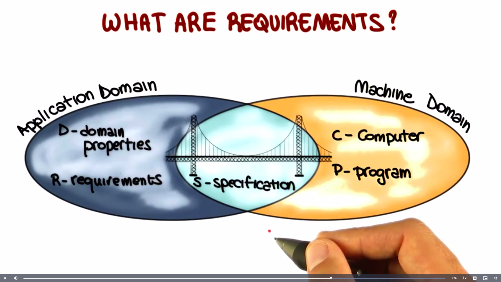
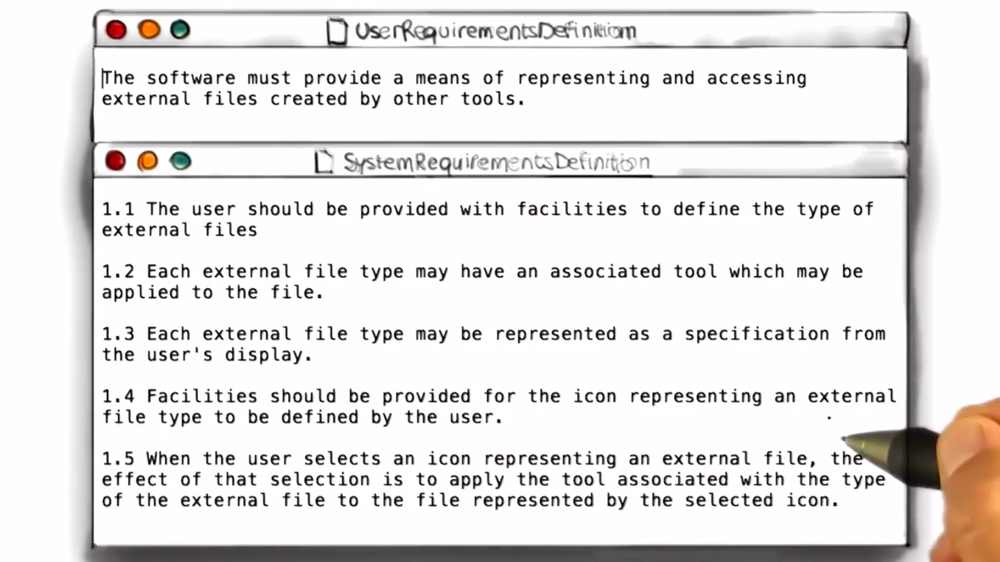
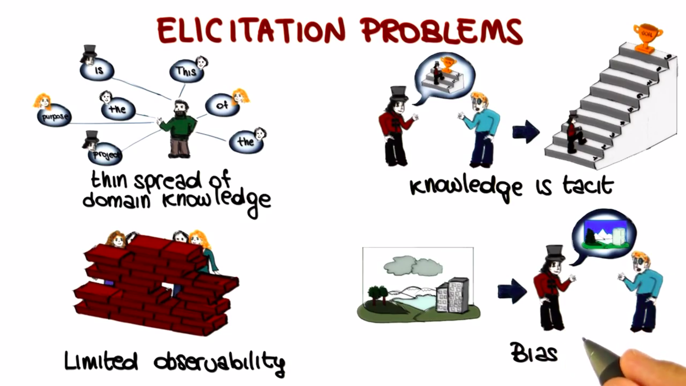
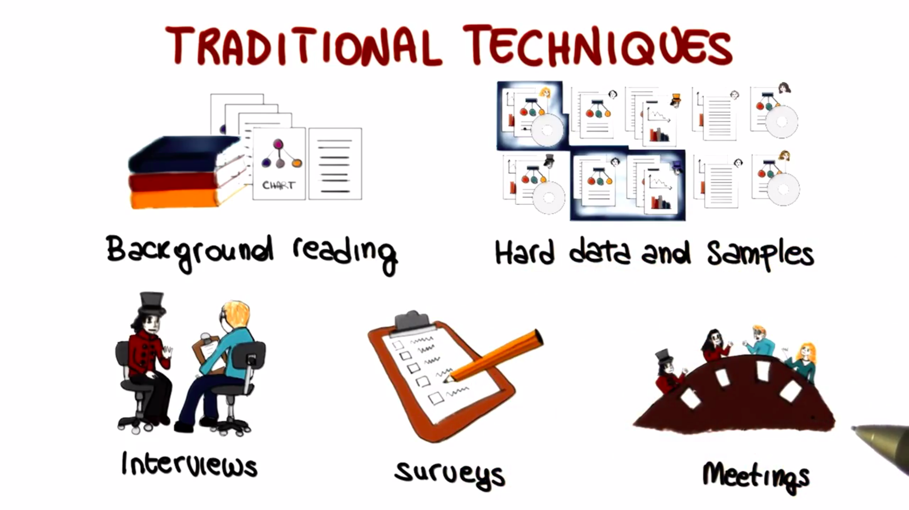
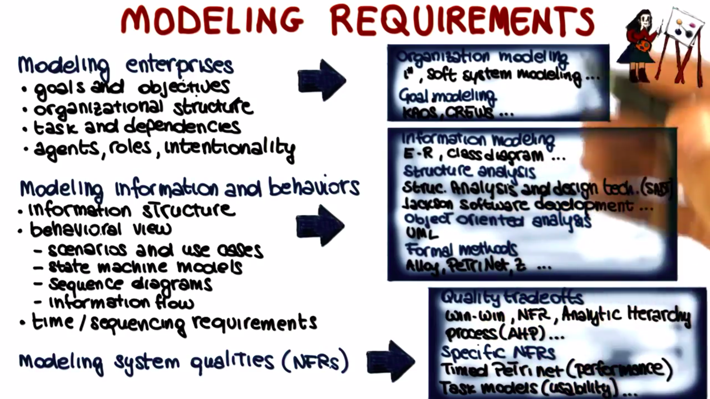

# Requirements Engineering:

> "It provides us a description of what system has to do. So, typically they describe the functionality of the features. That the system has to deliver in order to satisfy its stakeholders." ~ Jane Cleland-Huang

- Requirements Engineering is the process of establishing the `services that the customer requires from the software system.` In addition to that, requirements engineering also has to do with the constraints under which the system operates and is developed.

- Not detecting these Requirements Engineering errors can dramatically increase software costs.

- The final result of the Requirements Engineering process is a Software Requirements Specifications (SRS).

- Software Requirements Specifications and Requirements Engineering, in general, should focus on `what the proposed system is intended to do`, and not on the how it will do it.

  

## Software Intensive Systems:

`Software` is an `abstract description of a set of computations that becomes concrete`, and therefore useful, only when we run the software on some hardware, and that in the context of some human activity that it can support.

## Software Quality:

- Software runs on some hardware and is developed for a purpose that is related to human activities.

- Software Quality is not just a function of the software. The software itself does not define the quality of the overall system. Rather, `software quality is a function of both the software and its purpose`. Where purpose has to do with way in which the software will be used.

- The more the software fulfills its purpose, the more the software is on target, the higher is its quality. (Fitness of purpose)

- Identifying the purpose of the software, so hitting the target, it exactly the goal of requirements engineering.

## Identifying Purpose:

- Identifying Purpose = Defining Requirements.

- Identifying the purpose of the software and defining its requirements is very, very hard.

- **Why hard?**

  - Sheer complexity of purpose/requirements.
  - Often, people don't know what they want until you show it to them.
  - Changing requirements.
  - Multiple stakeholders with conflicting requirements.

## Completeness and Pertinence:

- These issues and difficulties can result in requirements that show various problems. Two particular relevant and common problems are the lack of `completeness` and `pertinence`.

  

- `Completeness` refers to the fact that it is often extremely d`ifficult to identify all of the requirements.` i.e, it is very difficult to have a complete picture of the purpose of the software. So, what happens is that incomplete requirements are collected and the software is missing functionality that is important for the user.

- `Pertinence` conversely has to do with the relevance of the requirements. To avoid completeness problems developers often end up `collecting a lot of irrelevant when not conflicting requirements.` In these cases what can happen is that the software could either end up being bloated that is it might contain a needed functionality. The functionality represented by these extra requirements or might even be impossible to build the software due to the conflicting additional requirements.

- And to make things `even worse` collecting all of these requirements sometimes doesn't even solve the completeness issue. So we might end up with a set of requirements that is not only incomplete but it also contains extra information that can be harmful to the system. So again the bottom line is that gathering an adequate, accurate, complete, and pertinent set of requirements that identify the purpose of a software system is an arduous task.

**Q. Consider an information system for a gym. In the list below, mark all the requirements that you believe are pertinent**

- [❌] members of the gym shall be able to access their training programs.
- [❌] the system shall be able to read member cards.
- [] the system shall be able to store members commute time.
- [❌] personal trainers shall be able to add clients.
- [] the list of members shall be stored as linked list.

Is the above list complete?

    [❌] Yes [✅] No

**Q. Why can irrelevant requirements be harmful?**

    [❌] they may lead to missing functionality in the final product.
    [✅] they can introduce inconsistency.
    [✅] they can waste project resources.
    [❌] they may introduce bugs in the software system.

## Best Practice?

- Developers or analysts usually identify a whole bunch of requirements. Sometimes the easiest & most obvious ones. They bring those to the stakeholders, and the stakeholders have to read the requirements, understand them, and if they agree, sign off on them.

- And the problem is that in general, these requirements documents are difficult to read. They are long, they are often unstructured. They typically contain a lot of information. And in general, they are not exactly a pleasant read.

- So what happens is that often the stakeholders are short on time, overwhelmed by the amount of information they're given and so they give in to the pressure and sign. And this is a bit of dramatization clearly but it's clear that what we are looking at is not an ideal scenario.

- Clearly this is not the way to identify the real purpose of a software system to collect good requirements. And since one of the major causes for project failure is the inadequacy of requirements, we should really avoid this kind of scenario.

- We should follow a rigorous and effective requirements engineering process instead.

## RE Definition Breakdown:

Requirements Engineering is a `set of activities` concerned with `identifying and communicating` the `purpose` of a software intensive system, and the `context` in which it will be used. Hence, RE acts as the bridge between the `real-world needs` of users, customers and other `constituencies` affected by a software system and the `capabilites and opportunities` afforded by software intensive technologies.

- `set of activities:` Not a phase or a stage
- `identifying and communicating:` Communication is as importatn as analysis.
- `purpose:` Quality means fitness-for-purpose. Cannot say anything about quality unless you understand the purpose.
- `context:` Designers need to know how and where the system will be used.
- `real-world needs:` Requirements are partly about what is needed...
- `constituencies:` Needed to identify all the stakeholders - not just the customer and the user.

## Defining Requirements:

Events in the real world that the machine can sense and actions in the real world that the cause. So this is what the specification is about, a bridge between these two worlds that define what the system should do to satisfy the requirements.

**Q. Referring to the figure that we just discussed, indicate, for each of the following items, whether they belong to ? (1) The machine domain (2) Application Domain (3) or their intersection (Enter the corresponding number 1, 2 or 3 in the entry next to the item.)**

    [1] An algorithm sorts a list of books in alphabetical order by the first author's name
    [3] A notification of the arrival of a message appears on a smartwatch
    [2] An employee wants to organize a meeting with a set of colleagues
    [3] A user clicks a link on a web page.

## Functional and Non-Functional Requirements:

`Functional` requirements have to do with the functionality of the system, with what the system does with teh computation. for e.g, the elevator shall take people to the floor they select.

`Non-Functional` requirements, conversely, refer to a system's non-functional properties, systems qualitites. Such as security, accuracy, performance, cost or usablity, adaptability, interoperability, reusablitiy and so on. for e.g, the elevator has to be fast.

## User and System Requirements:

| User Requirements                                | System Requirements                               |
| :----------------------------------------------- | :------------------------------------------------ |
| Written for customers                            | Written for developers                            |
| Often in natural languague, no technical details | Detailed functional & Non-Functional requirements |
|                                                  | Clearly & rigorously specified                    |

**Q. Which of the following requirements are non-functional requirements?**

    [✅] The BowlingAlley program keeps track of the score during a game.
    [❌] The WordCount program should be able to process large files.
    [❌] The login program for a website should be secure.
    [✅] The VendingMachine program should take coins as an input from the user.

## Requirements Origins:

- Stakeholders
- Application Domain
- Documentation

## Elicitation Problems:

## Traditional Techniques:

## Other Techniques:

- Collaborative Techniques
- Social Approaches
- Cognitive Techniques

## Modeling Requirements:

> What you want to model and how you want to model it.

- **Modeling Enterprises**

  - Goals and Objectives
  - Organizational Structure
  - Task & Dependencies
  - Agents, Roles, Intentionality

- **Modeling Information & Behaviour**

  - Information Structure
  - Behavioural View
    - Scenarios & Use Cases
    - State Machine Models
    - Sequence Diagrams
    - Information Flow
  - Time / Sequencing Requirements

- **Modeling System Qualities (Non-Functional Requirements)**

  

## Analyzing Requirements:

- **Verification:** Developers will study the requirements to check whether they're correct, whether they accurately reflect the customer needs as perceived by the developer. Developers can also check the completeness of the requirements, check whether there are any missing pieces in the requirements. They can check whether the requirements are pertinent, or contain irrelevant information, also check for consistent, unambiguous, testable and so on.

- **Validation:** The goal of validation is to assess whether the collected requirements define the system that the stakeholders really want. So the focus here is on the stakeholders. Another possibility is that stakeholders asses the requirements by interacting with a prototype of the system.

- **Risk Analysis:** Aims to identify and analyze the main risks involved with the development of the system being considered. And if some requirements are deemed to be too risky, this might result in changes in the requirements model to eliminate or address those risks.

## Requirements Prioritization:
