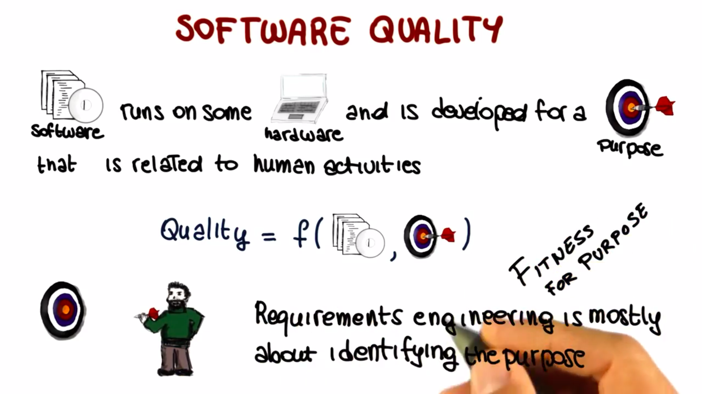

# Requirements Engineering:

> "It provides us a description of what system has to do. So, typically they describe the functionality of the features. That the system has to deliver in order to satisfy its stakeholders." ~ Jane Cleland-Huang

- Requirements Engineering is the process of establishing the `services that the customer requires from the software system.` In addition to that, requirements engineering also has to do with the constraints under which the system operates and is developed.

- Not detecting these Requirements Engineering errors can dramatically increase software costs.

- The final result of the Requirements Engineering process is a Software Requirements Specifications (SRS).

- Software Requirements Specifications and Requirements Engineering, in general, should focus on `what the proposed system is intended to do`, and not on the how it will do it.

  

## Software Intensive Systems:

`Software` is an `abstract description of a set of computations that becomes concrete`, and therefore useful, only when we run the software on some hardware, and that in the context of some human activity that it can support.

## Software Quality:

- Software runs on some hardware and is developed for a purpose that is related to human activities.

- Software Quality is not just a function of the software. The software itself does not define the quality of the overall system. Rather, `software quality is a function of both the software and its purpose`. Where purpose has to do with way in which the software will be used.

- The more the software fulfills its purpose, the more the software is on target, the higher is its quality. (Fitness of purpose)

- Identifying the purpose of the software, so hitting the target, it exactly the goal of requirements engineering.

## Identifying Purpose:

- Identifying Purpose = Defining Requirements.

- Identifying the purpose of the software and defining its requirements is very, very hard.

- **Why hard?**

  - Sheer complexity of purpose/requirements.
  - Often, people don't know what they want until you show it to them.
  - Changing requirements.
  - Multiple stakeholders with conflicting requirements.

## Completeness and Pertinence:

- These issues and difficulties can result in requirements that show various problems. Two particular relevant and common problems are the lack of `completeness` and `pertinence`.

  

- `Completeness` refers to the fact that it is often extremely d`ifficult to identify all of the requirements.` i.e, it is very difficult to have a complete picture of the purpose of the software. So, what happens is that incomplete requirements are collected and the software is missing functionality that is important for the user.

- `Pertinence` conversely has to do with the relevance of the requirements. To avoid completeness problems developers often end up `collecting a lot of irrelevant when not conflicting requirements.` In these cases what can happen is that the software could either end up being bloated that is it might contain a needed functionality. The functionality represented by these extra requirements or might even be impossible to build the software due to the conflicting additional requirements.

- And to make things `even worse` collecting all of these requirements sometimes doesn't even solve the completeness issue. So we might end up with a set of requirements that is not only incomplete but it also contains extra information that can be harmful to the system. So again the bottom line is that gathering an adequate, accurate, complete, and pertinent set of requirements that identify the purpose of a software system is an arduous task.

**Q. Consider an information system for a gym. In the list below, mark all the requirements that you believe are pertinent**

- [❌] members of the gym shall be able to access their training programs.
- [❌] the system shall be able to read member cards.
- [] the system shall be able to store members commute time.
- [❌] personal trainers shall be able to add clients.
- [] the list of members shall be stored as linked list.

Is the above list complete?

    [❌] Yes [✅] No

**Q. Why can irrelevant requirements be harmful?**

    [❌] they may lead to missing functionality in the final product.
    [✅] they can introduce inconsistency.
    [✅] they can waste project resources.
    [❌] they may introduce bugs in the software system.

## Best Practice?

- Developers or analysts usually identify a whole bunch of requirements. Sometimes the easiest & most obvious ones. They bring those to the stakeholders, and the stakeholders have to read the requirements, understand them, and if they agree, sign off on them.

- And the problem is that in general, these requirements documents are difficult to read. They are long, they are often unstructured. They typically contain a lot of information. And in general, they are not exactly a pleasant read.

- So what happens is that often the stakeholders are short on time, overwhelmed by the amount of information they're given and so they give in to the pressure and sign. And this is a bit of dramatization clearly but it's clear that what we are looking at is not an ideal scenario.

- Clearly this is not the way to identify the real purpose of a software system to collect good requirements. And since one of the major causes for project failure is the inadequacy of requirements, we should really avoid this kind of scenario.

- We should follow a rigorous and effective requirements engineering process instead.

## RE Definition Breakdown:
