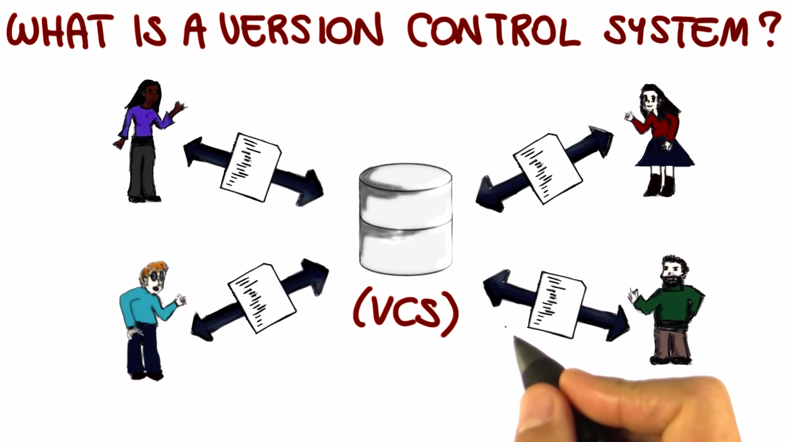
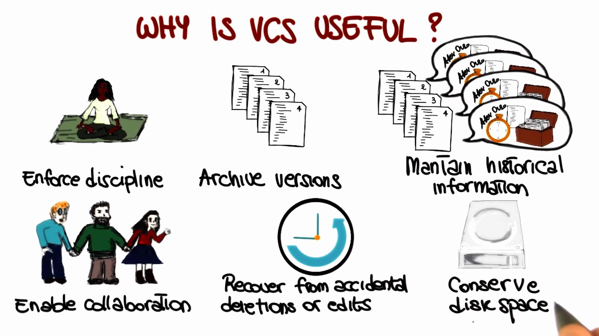
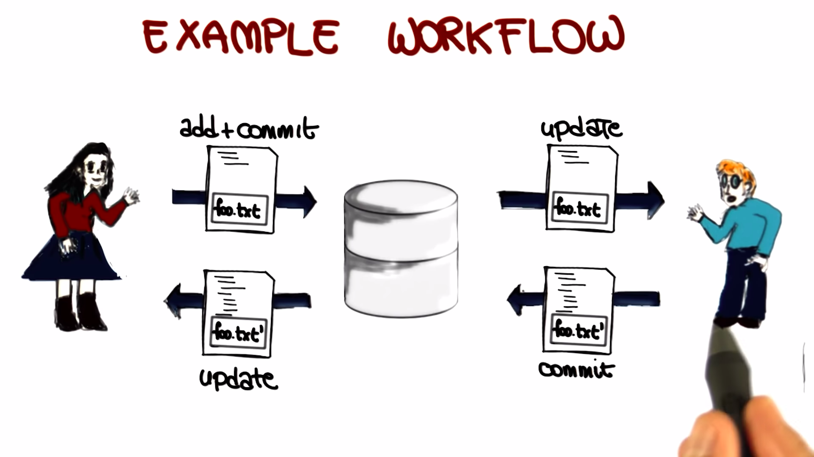
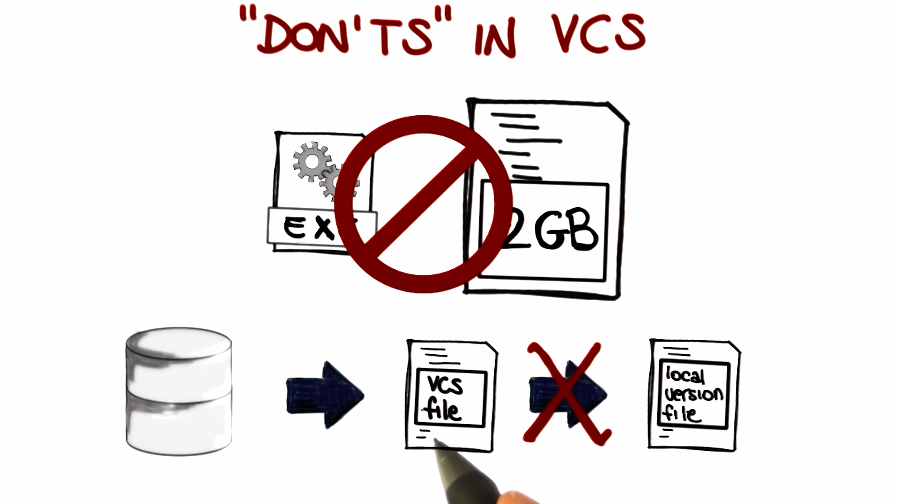
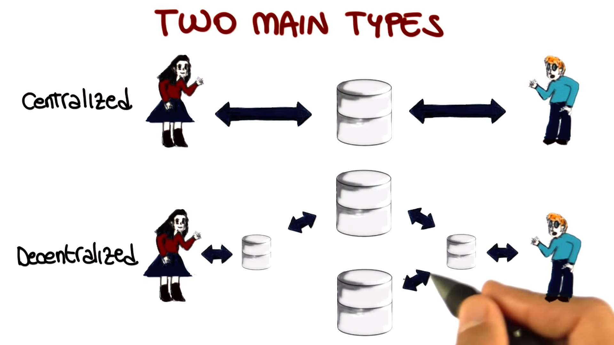
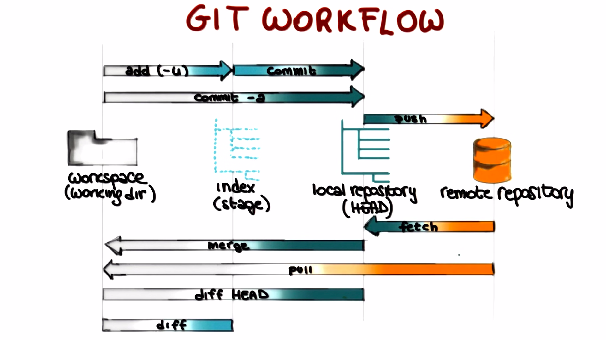
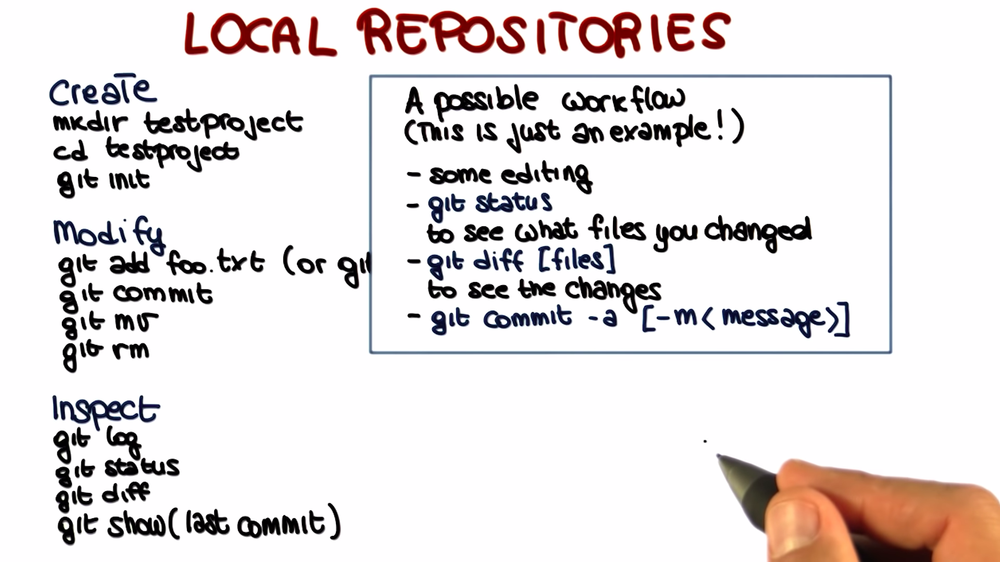
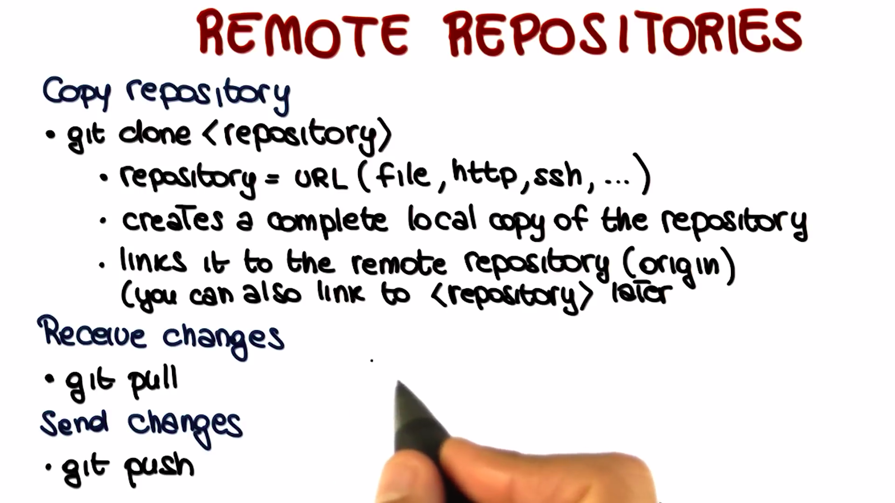

# Version Control

Version Control Systems are used to track changes to a project's source code, documentation, and other files.

Additional materials on Git:

- [Git tutorial](https://www.atlassian.com/git)
- [Git cheat sheet](https://education.github.com/git-cheat-sheet-education.pdf)
- [Git--the simple guide](http://rogerdudler.github.io/git-guide/)
- [A successful Git branching model](https://nvie.com/posts/a-successful-git-branching-model/)
- [The Git Parable by Tom Preston-Werner](https://tom.preston-werner.com/2009/05/19/the-git-parable.html)
- [How to Use Git and GitHub (Udacity's mini-course)](https://www.udacity.com/course/version-control-with-git--ud123)

## Version Control System Introduction

A `version control system` (VCS) is a software system that allows you to manage multiple revisions of the same unit of information.

**For e.g,** documents, of source files or any other item of that sort.

A VCS allows a multiple actors to cooperate and share files.

**Why is it important?**

- Using a VCS enforces discipline, because it manages the process by which the control of items passes from one person to another.

- Allows us for archiving versions, so that we can store subsequent versions of source controlled items into a VCS.

- Maintain a lot of historical information about the changes that have been made to the source code.

- Having a central repository in which all these items are stored enables collaboration and sharing of information.

- Recover from accidental deletions or edits.

- It allows us to conserve and save disk space on both the source control client and on the serve.

  

## Essential Actions

- `Addition` of files to a repository.

- `Commit` of changes to a repository.

- `Update` of files in a repository.

## Example Workflow

## Don't in VCS

There are two kinds of resources which we don't want to add to a VCS normally:

- Derived files (e.g. compiled files, executables, etc.)
- Temporary files (e.g. temporary files, temporary directories, bulky files, etc.)

  

## Two Main Types of VCS

- `Centralized:` A centralized VCS is a VCS which is centralized on a single machine.

- `Decentralized:` A decentralized VCS is a VCS which is distributed across multiple machines.

  

## Introduction to Git

Git is a distributed version control system that was initially designed and developed by Linux Torvalds.

## Git Workflow

## Local Repositories

## Remote Repositories

